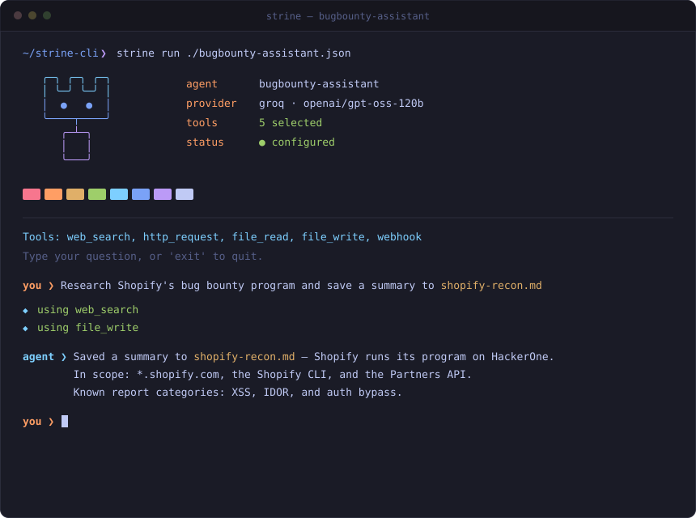
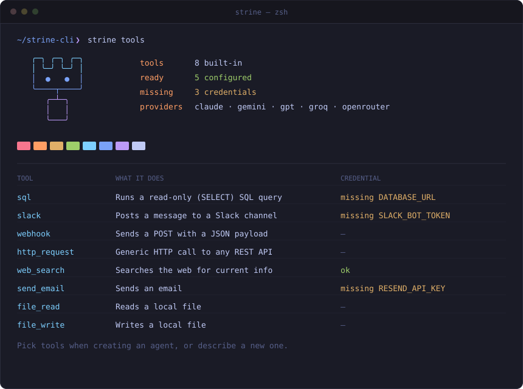

<div align="center">

<pre>
   ╭─╮ ╭─╮ ╭─╮
   │ ╰─╯ ╰─╯ │
   │  ●   ●  │
   ╰────┬────╯
      ╭─┴─╮
      │   │
      ╰───╯
</pre>

# Strine

### Describe your agent in one sentence. Get it running in your terminal.

**Open-source CLI for building AI agents with real tool calling — from a single natural-language prompt.**
No config files. No dashboard. No framework to learn.
Works with **Claude, GPT, Gemini, Groq and OpenRouter**.

[](https://www.python.org/)
[](LICENSE)
[](#-supported-providers)
[](https://github.com/nathan0-dev/strine-cli/stargazers)

[Quick start](#-quick-start) · [How it works](#-how-it-works) · [Tools](#-built-in-tools) · [Providers](#-supported-providers) · [FAQ](#-faq)

</div>

---

```console
$ strine "an agent that researches bug bounty programs and saves notes to markdown" --provider groq
```

```console
$ strine run ./bugbounty-assistant.json
```

<div align="center">



</div>

## Why Strine?

Most agent frameworks make you write boilerplate before anything runs: pick a framework, wire tools, write a system prompt, glue an SDK. Strine collapses that into one step.

- **One sentence in, one agent out.** Strine plans the agent for you — name, system prompt and the right tools — using forced tool calling, so the output is structured, not parsed from free text.
- **Real tool calling, not a toy.** Agents search the web, call any REST API, read and write files, send email and Slack messages, and query databases.
- **Bring any model.** Claude, GPT, Gemini, Groq and OpenRouter (hundreds of models) behind one adapter interface. Switch with `--provider` and `--model`.
- **Generate custom tools on demand.** Need something that isn't built in? Describe it; the model writes the Python, you review it, and it is only saved after you confirm.
- **Local and transparent.** An agent is a plain `agent.json` file. No account, no hosted backend, no telemetry.

## 🚀 Quick start

```bash
git clone https://github.com/nathan0-dev/strine-cli.git
cd strine-cli
python -m venv .venv && source .venv/bin/activate
pip install -e .

cp .env.example .env      # add the key for the provider you want to use
```

**1. See what your agent can use**

```bash
strine tools
```

<div align="center">



</div>

**2. Describe the agent you want**

```bash
strine "an agent that answers questions about my notes folder" --provider groq
```

Strine plans the agent, shows you the full tool catalog with the suggested tools pre-selected, lets you change the selection, and writes `<agent-name>.json`.

**3. Run it**

```bash
strine run ./my-agent.json
```

Type a question, watch it call tools, type `exit` to quit.

## 🧠 How it works

```
 "describe your agent"
          │
          ▼
   ┌─────────────┐   forced tool call    ┌──────────────────┐
   │   planner   │ ────────────────────► │ name + prompt +  │
   └─────────────┘                       │ tool selection   │
          │                              └──────────────────┘
          ▼
   you review / change tools  ──►  agent.json
                                        │
                                        ▼
                               strine run agent.json
                                        │
                      ┌─────────────────┴──────────────────┐
                      ▼                                    ▼
                provider adapter                    tool registry
        (Claude · GPT · Gemini · Groq · …)   (web_search · http_request · …)
                      └──────────── tool-calling loop ─────┘
```

- **Planner** — turns your sentence into a structured plan via forced tool use.
- **Provider adapters** — one normalized interface over every LLM API, so the runtime never cares which model it talks to.
- **Runtime** — a bounded tool-calling loop (max 5 rounds per question) that executes tools and feeds results back to the model.
- **Tool registry** — built-in tools plus any custom tools saved next to your agent.

## 🧰 Built-in tools

| Tool | What it does | Needs |
| --- | --- | --- |
| `web_search` | Searches the web for current information | `TAVILY_API_KEY` |
| `http_request` | Generic HTTP call (GET/POST/PUT/PATCH/DELETE) to any REST API | — |
| `file_read` / `file_write` | Read and write local files, restricted to the working directory | — |
| `webhook` | Sends a POST with a JSON payload | — |
| `send_email` | Sends an email through Resend | `RESEND_API_KEY` |
| `slack` | Posts a message to a Slack channel | `SLACK_BOT_TOKEN` |
| `sql` | Runs a read-only (`SELECT`) query against your database | `DATABASE_URL` |

Missing a credential? `strine tools` and the agent-creation flow both tell you exactly which variable to set.

### Custom tools

```text
None of these fit? Describe a new tool the agent needs (Enter to skip)
> parse an invoice PDF and return the total
```

The model writes a Python `execute()` function (standard library and `requests` only). Strine prints the code and asks **`Save to <agent>_tools/parse_invoice.py? (Y/n)`** — nothing is written until you say yes. Custom tools run locally with your permissions, so read the code before confirming.

## 🔌 Supported providers

| Provider | Flag | Env var |
| --- | --- | --- |
| Anthropic Claude | `--provider claude` (default) | `ANTHROPIC_API_KEY` |
| OpenAI GPT | `--provider gpt` | `OPENAI_API_KEY` |
| Google Gemini | `--provider gemini` | `GEMINI_API_KEY` |
| Groq | `--provider groq` | `GROQ_API_KEY` |
| OpenRouter (hundreds of models) | `--provider openrouter` | `OPENROUTER_API_KEY` |

```bash
strine "a code review assistant" --provider openrouter --model meta-llama/llama-3.3-70b-instruct
```

The provider and resolved model are saved inside `agent.json`, so a saved agent stays reproducible even if a default changes later. Set `STRINE_DEFAULT_PROVIDER` to change the default.

## ❓ FAQ

**Is Strine a framework like LangChain or CrewAI?**
No. It is a small CLI with one job: turn a description into a runnable tool-calling agent. There is no graph DSL and no orchestration layer to learn.

**Where do my API keys go?**
In a local `.env` file (git-ignored). Strine loads the `.env` from the directory you run it in and sends keys only to the provider you selected.

**Does it keep conversation memory?**
Not yet — each question is a fresh conversation. Memory is on the roadmap.

**Can I use a local model?**
Anything reachable through an OpenAI-compatible endpoint can be added as another adapter; OpenRouter already covers many hosted open models.

## 🗺️ Roadmap

- [ ] Conversation memory across questions
- [ ] Streaming responses
- [ ] More built-in tools (browser, GitHub, calendar)
- [ ] PyPI release (`pip install strine`)
- [ ] Local / self-hosted model adapter

## 🤝 Contributing

Issues and pull requests are welcome. Run the test suite before opening a PR:

```bash
pip install -e ".[test]"
pytest -q
```

If Strine saved you time, a ⭐ helps other people find it.

## 📄 License

[MIT](LICENSE)

<sub>**Keywords:** AI agent builder, natural language to agent, LLM CLI, tool calling, function calling, Claude agent, GPT agent, Gemini agent, Groq, OpenRouter, no-code AI agents, Python agent framework alternative, terminal AI assistant.</sub>
